# Something
# Android ToDo Application
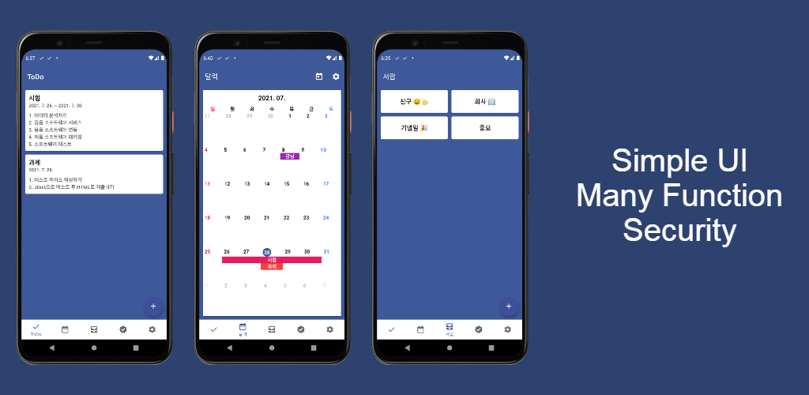

https://play.google.com/store/apps/details?id=com.taetae98.something

## 😊 Introduction
* #### ToDoFragment
* #### RecyclerView를 사용하여 List 형식으로 ToDo를 쉽게 확인할 수 있습니다.
* #### ItemTouchHelper를 사용하여 ToDo를 제서쳐로 지울 수 있습니다.
* #### You can use RecyclerView to easily check ToDo in List format.
* #### You can use ItemTouchHelper to clear ToDo with a manual.
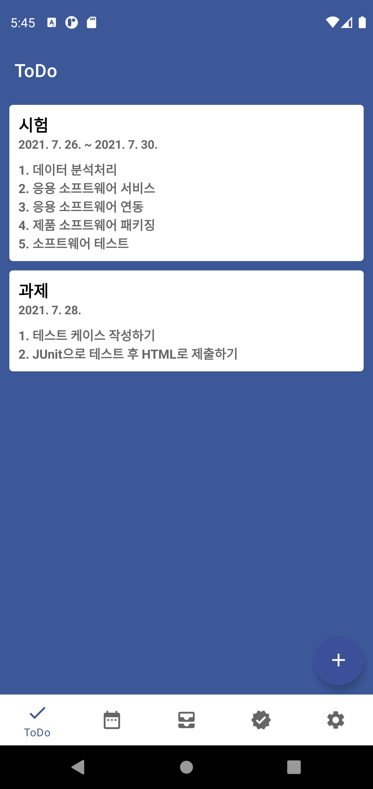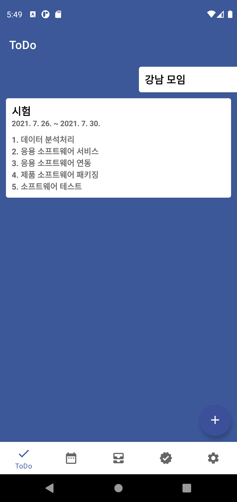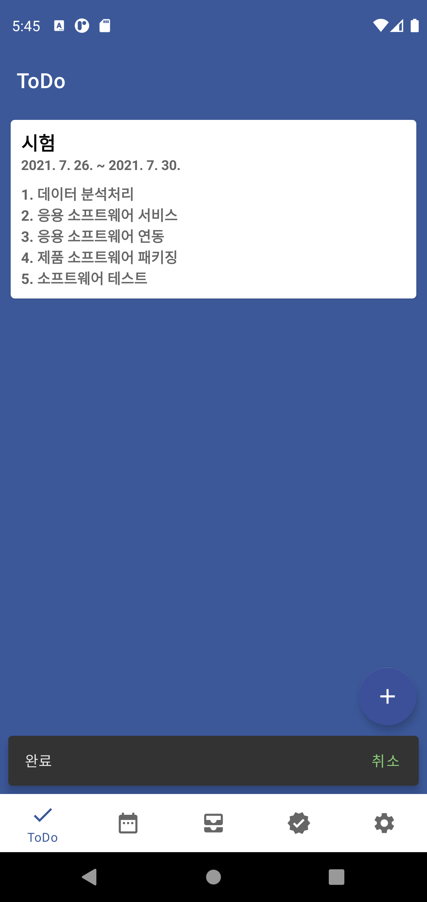
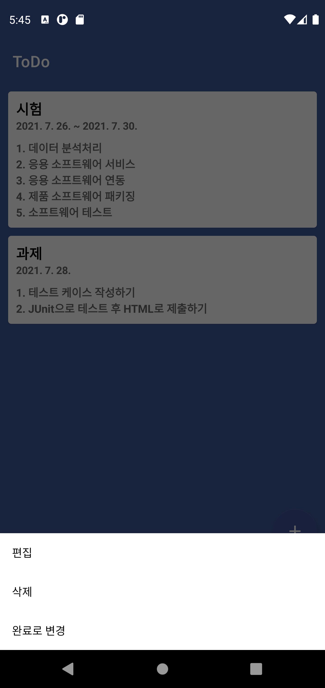

* #### CalendarFragment
* #### 직접 만든 CalendarView를 사용하여 ToDo를 한 눈에 확인할 수 있습니다.
* #### You can view ToDo at a glance using your own CalendarView.
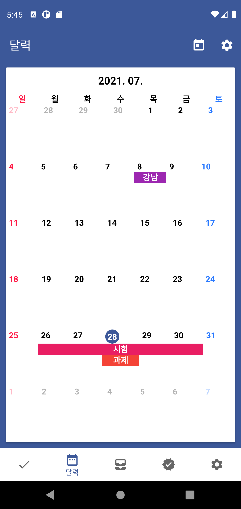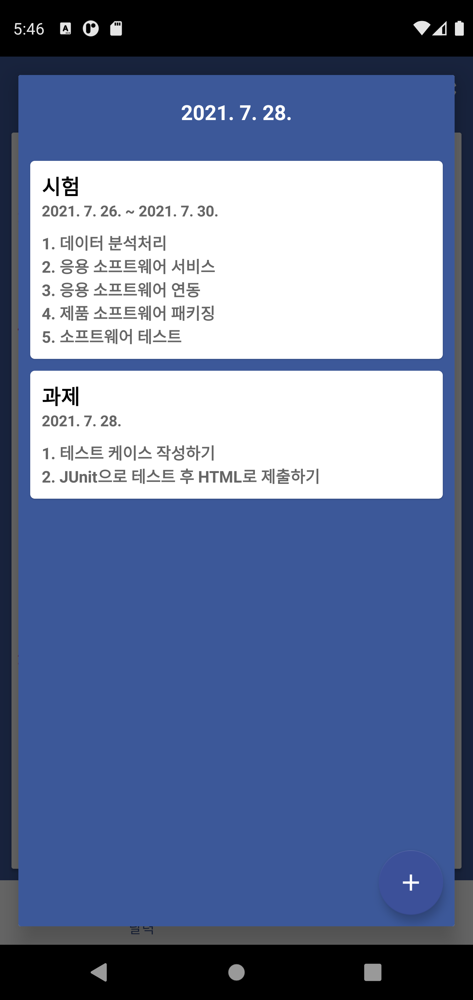

* #### DrawerFragment
* #### 서랍 기능을 통해 ToDo를 주제별로 분류하고 확인할 수 있습니다.
* #### 민감한 정보는 잠금 기능을 사용하여 보호할 수 있습니다.
* #### Drawer function allows you to categorize and check ToDo by topic.
* #### Sensitive information can be protected using the lock function.
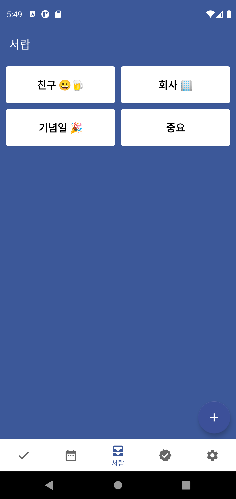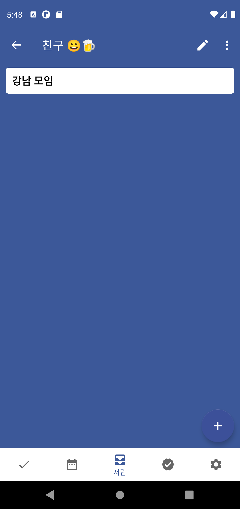
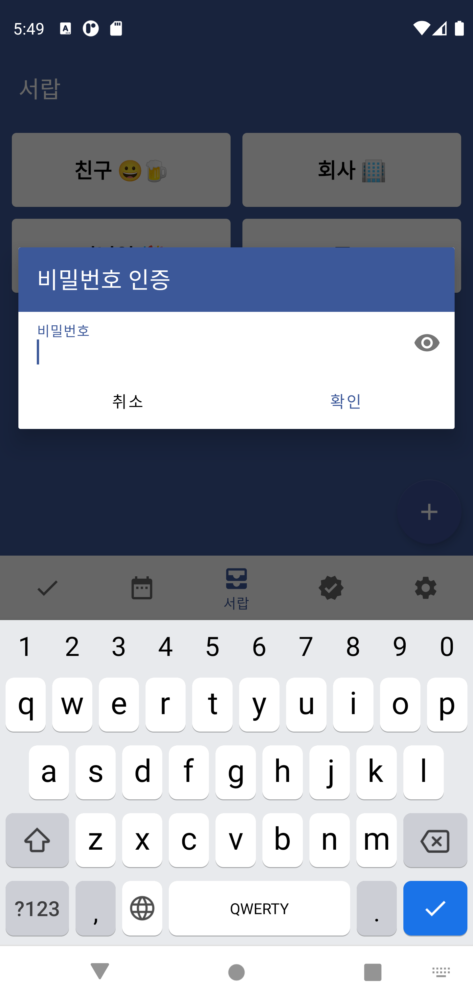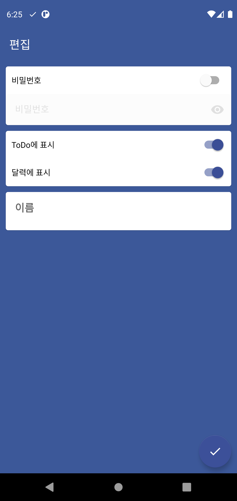

* #### FinishedFragment
* #### 완료된 ToDo를 확인할 수 있습니다.
* #### You can check the ToDo completed.
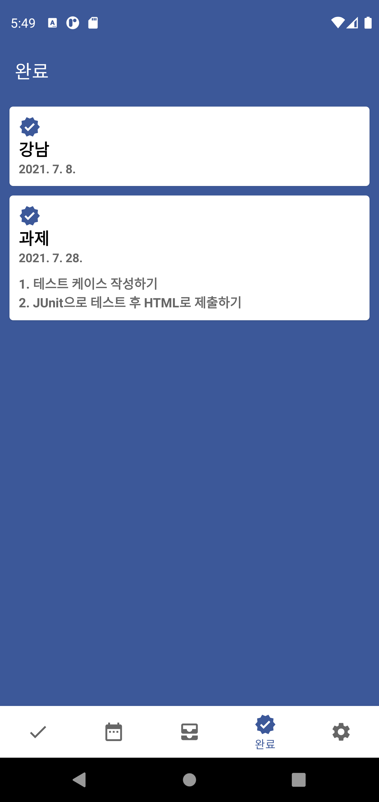

* #### SettingFragment
* #### 앱에 대한 설정을 할 수 있습니다.
* #### You can set up settings for the app.
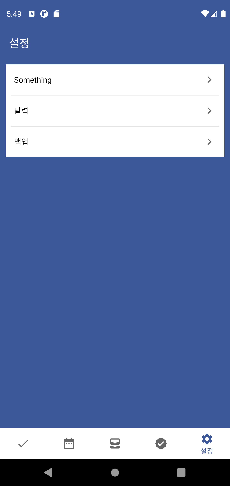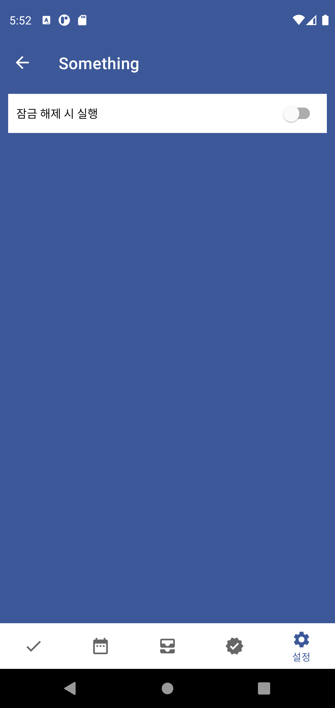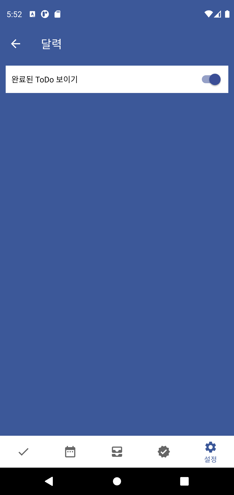

* #### BackupFragment
* #### Firebase와 연동하여 백업을 진행할 수 있습니다.
* #### You can proceed with the backup in conjunction with Firebase.
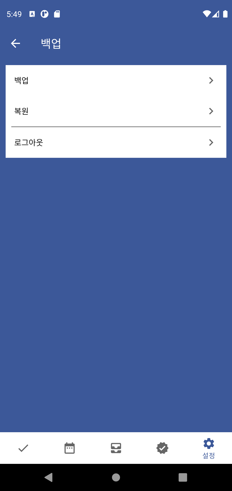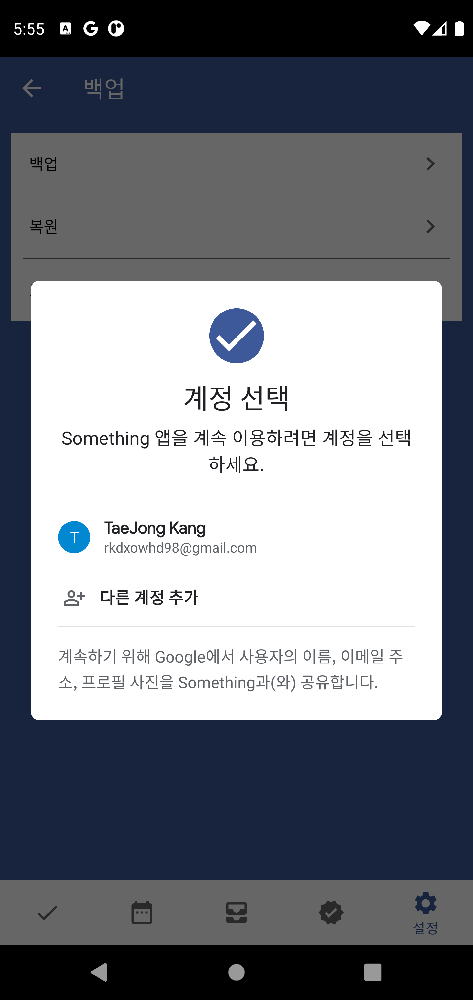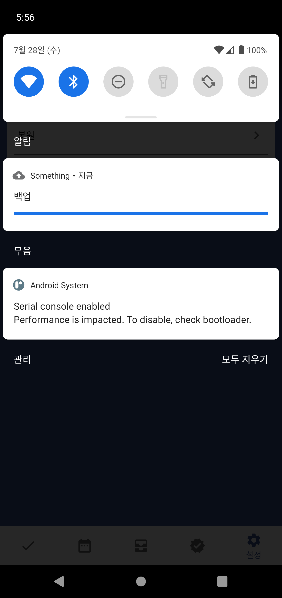

* #### ETC
* #### Notification 기능을 사용하여 알림창에 ToDo를 표시할 수 있다.
* #### Sticky 기능을 사용하여 핸드폰 잠금해제시 바로 앱을 실행시킬 수 있다.
* #### You can use the Notification function to display ToDo in the notification window.
* #### The Sticky function allows you to launch the app immediately after unlocking your phone.
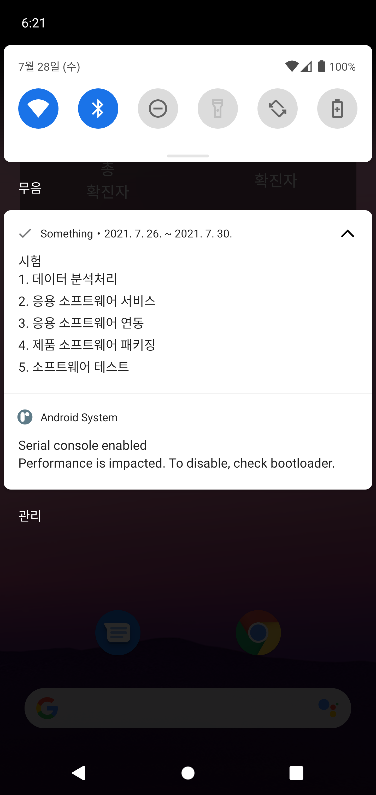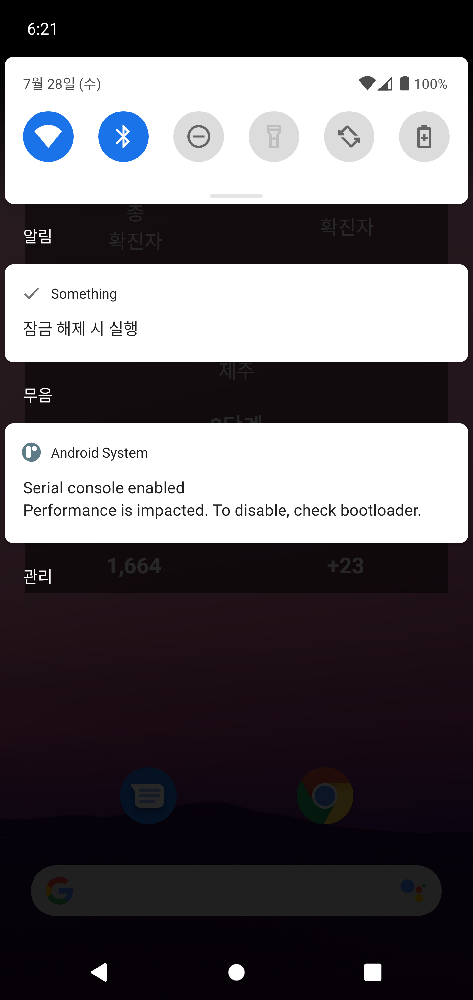

## 🚀 Android Jetpack

* ### Room : SQLite를 대체하여 Android에 Local Database를 쉽게 구축할 수 있는 라이브러리. ToDo와 Drawer를 관리할 수 있다.
* ### ViewModel & LiveData : ViewModel과 LiveData를 연동하여 UI Controller와 데이터를 분리하여 관리할 수 있고, DataBinding을 사용하여 UI를 쉽게 구축할 수 있다.
* ### Navigation : Activity의 생성, Stack관리 등에 대한 부담을 Fragment를 사용해 줄일 수 있고, 에니메이션과 SafeArgs 등 편리하게 UI를 구성할 수 있다.
* ### Hilt : Android에 DI 패턴을 적용하여 Manager, Repository 등 전역에서 사용하는 기능들을 쉽게 관리할 수 있다.
* ### DataStore : SharedPreferences를 대체할 수 있고 Key : Value 형식으로 값을 저장하여 설정 값을 관리할 수 있다.
* ### Room : A library that can easily be deployed on Android to replace SQLite. I can manage ToDo and Drawer.
* ### ViewModel & LiveData : ViewModel과 LiveData를 연동하여 UI Controller와 데이터를 분리하여 관리할 수 있고, DataBinding을 사용하여 UI를 쉽게 구축할 수 있다.
* ### Navigation : The burden of generating activity and managing stacks can be reduced using Fragment, and UI can be conveniently configured such as animation and SafeArgs.
* ### Hilt : Applying DI patterns to Android makes it easy to manage functions used globally such as Manager, Repository, etc.
* ### DataStore : You can replace Shared Preferences and manage the set value by saving the value in Key: Value format.

## ⚡ Features
* ToDo : ToDo 목록을 List 형식, Calendar 형식으로 쉽게 확인할 수 있고, 제스처를 사용하여 쉽게 사용할 수 있다.
* Drawer : ToDo를 주제별로 분류하여 관리할 수 있다.
* Sticky Mode : 핸드폰 잠금화면시 앱을 바로 실행시키는 기능으로 ToDo를 깜빡하지 않고 확인할 수 있다.
* Notification : 핸드폰 알림창에 ToDo를 표시하여 쉽게 확인할 수 있다.
* Security : Drawer에 잠금 기능을 사용하여 민감한 ToDo를 관리할 수 있다.
* Backup : Firebase와 Google Account를 통해 백업/복원을 진행할 수 있다.
* DarkMode : 다크모드를 지원합니다.
* ToDo : The ToDo list can be easily checked in List format and Calendar format, and can be used easily using gestures.
* Drawer : ToDo can be categorized by subject and managed.
* Sticky Mode: You can check ToDo without forgetting to run the app immediately when you lock your phone.
* Notification : You can easily check it by displaying ToDo in the mobile phone notification window.
* Security : Lock on Drawer to manage sensitive ToDo.
* Backup : Firebase and Google Account allow backup/restore.
* DarkMode :Supports dark mode.